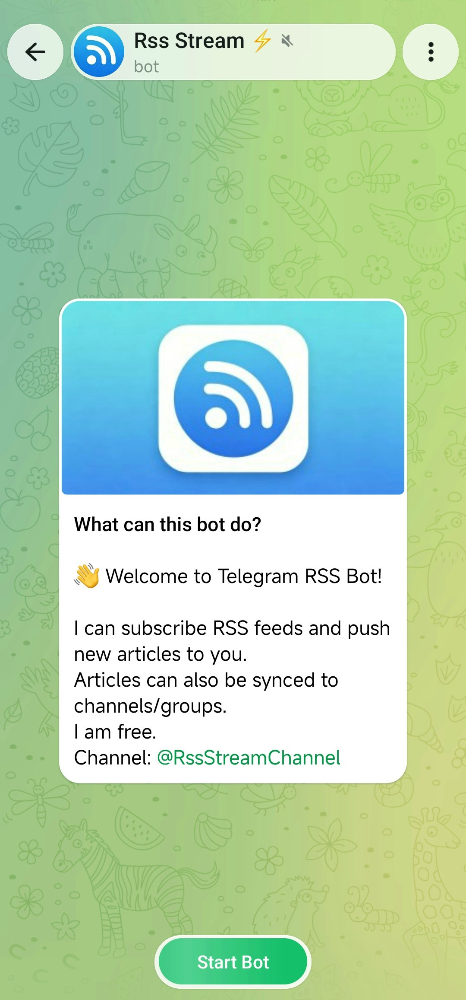

# 🚀 RssStream Bot

**RSS → Telegram automation bot for creators, developers, and community managers**

Automatically deliver RSS feed updates to your Telegram channels or groups in real time.

---

## ✨ What is RssStream?

RssStream is a lightweight automation bot that connects **RSS feeds → Telegram**.

It helps you turn any RSS source into a real-time content delivery pipeline.

Typical use cases:

- 📰 News aggregation channels
- 📢 Telegram community automation
- 💻 GitHub release tracking
- 📚 Blog / content distribution
- 📊 Monitoring updates from multiple sources

---

## ⚡ Key Features

- 📡 Subscribe to unlimited RSS feeds (based on plan)
- 🔔 Auto push updates to Telegram channels/groups
- 🔗 Multi-channel / multi-group support
- 🧩 Simple commands (`/add`, `/bind`)
- 🔄 Subscription recovery (important for account changes or loss)
- ⚙️ Low-latency update delivery
- 📦 Clean and minimal design (no clutter)

---

## 🧠 Why RssStream?

Most RSS tools are either:

- Too heavy (full RSS readers)
- Too limited (no automation)
- Not reliable for Telegram delivery

RssStream focuses on one thing only:

> **Reliable RSS → Telegram automation**

No distractions. No complexity.

---

## ⚙️ How it works

```mermaid
flowchart LR
A[RSS Feed] --> B[RssStream Bot]
B --> C[Processing & Filtering]
C --> D[Telegram Channel / Group]
````

1. You bind an RSS feed to a channel/group
2. Bot monitors updates continuously
3. New articles are pushed instantly to Telegram

---

## 🚀 Quick Start

### 1. Start bot

Open Telegram and start:

```
https://t.me/rssStreamBot
```

### 2. Bind RSS feed

```
/bind https://example.com/rss
```

### 3. Done 🎉

New posts will be delivered automatically.

---

## 💬 Example Use Cases

### 📰 Tech News Channel

* Hacker News RSS
* TechCrunch RSS
* Product Hunt RSS

### 💰 Crypto Updates

* CoinMarketCap RSS
* Exchange announcements
* Token news feeds

### 💻 DevOps / Engineering

* GitHub releases
* Open-source updates
* Blog engineering posts

---

## 🧩 Commands

| Command             | Description            |
| ------------------- | ---------------------- |
| `/add <rss_url>`    | Bind RSS feed          |
| `/remove <rss_id>` | Remove feed            |
| `/bind <rss_id>`    | Bind feed to channel/group|
| `/list`             | Show all subscriptions |
| `/lang`             | Change language |
| `/help`             | Show help menu         |

---

## 💡 Subscription Recovery (Important Feature)

If your Telegram account is lost, changed, or restricted:

👉 You can recover your subscriptions using your recovery ID.

This ensures your RSS automation is never lost.

---

## 💰 Pricing

| Plan           | Features                          |
| -------------- | --------------------------------- |
| Free           | Basic RSS subscriptions, 100 feed |
| Pro ($5/month) | Higher limits + advanced features |

Pro features may include:

* More feeds per account
* Faster delivery priority
* Advanced filtering rules
* Priority support

---

## 📦 Roadmap

* [ ] RSS keyword filtering
* [ ] AI summary for articles
* [ ] Web dashboard
* [ ] Webhook integrations
* [ ] Multi-platform support (Discord, Slack)

---

## 📸 Screenshots

> 

---

## 📣 Why this project exists

I built RssStream because I needed a reliable way to:

* Automate content distribution
* Avoid manually posting updates
* Keep Telegram channels active with minimal effort

This is a focused tool for people who want **automation, not reading tools**.

---

## 🤝 Contributing

Pull requests and feature suggestions are welcome.

---

## 📬 Feedback

If you have ideas or issues, feel free to open an issue or contact via Telegram.

---

## ⭐ Support

If you find this project useful, consider giving it a star ⭐

It really helps the project grow.

---