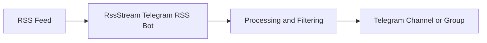

# Telegram RSS Bot - RssStream (RSS to Telegram Automation)

[](./README.md)
[](./README.zh-CN.md)

RssStream is a Telegram RSS bot that automatically sends RSS feed updates to your Telegram channels and groups.

If you are looking for a reliable RSS to Telegram bot, RssStream helps you track feeds, push new posts in real time, and manage subscriptions with simple commands.

Open the bot: [Start RssStream on Telegram](https://t.me/rssStreamBot)

---

## Table of Contents

- [What is RssStream](#what-is-rssstream)
- [Key Features](#key-features)
- [How It Works](#how-it-works)
- [Quick Start](#quick-start)
- [Commands](#commands)
- [Example Use Cases](#example-use-cases)
- [Subscription Recovery](#subscription-recovery)
- [Pricing](#pricing)
- [FAQ](#faq)
- [Roadmap](#roadmap)
- [Screenshot](#screenshot)
- [Contributing](#contributing)
- [Feedback](#feedback)

---

## What is RssStream

RssStream is an automation-focused Telegram RSS bot that connects RSS feeds to Telegram delivery.

It is built for creators, developers, and community managers who want RSS updates in Telegram without manual reposting.

Typical use cases:

- News aggregation channels
- Telegram community automation
- GitHub release tracking
- Blog and content distribution
- Monitoring updates from multiple RSS sources

---

## Key Features

- Subscribe to RSS feeds (plan-based limits)
- Auto-push new RSS items to Telegram channels and groups
- Multi-channel and multi-group delivery
- Simple bot commands for feed management (`/add`, `/bind`, `/list`)
- Subscription recovery for account loss or migration
- Low-latency update delivery
- Minimal workflow focused on automation

---

## How It Works



1. Add or bind an RSS feed to your Telegram destination.
2. RssStream monitors the feed for new entries.
3. New posts are delivered to Telegram automatically.

---

## Quick Start

### 1. Start the bot

Open Telegram and launch: [https://t.me/rssStreamBot](https://t.me/rssStreamBot)

### 2. Add or bind a feed

```bash
/add https://example.com/rss
/bind <feed_id>
```

### 3. Receive updates

RssStream will push new RSS posts to your Telegram channel or group.

---

## Commands

| Command | Description |
| --- | --- |
| `/add <rss_url>` | Add an RSS feed to your account. |
| `/remove <rss_id>` | Remove a feed from your subscriptions. |
| `/bind <rss_id_or>` | Bind a feed to a Telegram channel or group. |
| `/list` | List all RSS subscriptions and bindings. |
| `/lang` | Change bot language. |
| `/help` | Show command help and usage examples. |

---

## Example Use Cases

### Tech news channel

- Hacker News RSS
- TechCrunch RSS
- Product Hunt RSS

### Crypto updates

- CoinMarketCap RSS
- Exchange announcement feeds
- Token project news feeds

### DevOps and engineering

- GitHub releases RSS
- Open-source project updates
- Engineering blog posts

---

## Subscription Recovery

If your Telegram account is lost, changed, or restricted, you can recover your RSS subscriptions using your recovery ID.

This keeps your Telegram RSS automation stable across account changes.

---

## Pricing

| Plan | Features |
| --- | --- |
| Free | Basic RSS subscriptions, up to 100 feeds |
| Pro ($5/month) | Higher limits and advanced features |

Pro features may include:

- More feeds per account
- Faster delivery priority
- Advanced filtering rules
- Priority support

---

## FAQ

### What is the best way to get RSS updates in Telegram?

Use a Telegram RSS bot like RssStream, then add and bind your RSS feed so new posts are pushed automatically.

### How do I add an RSS feed to a Telegram group?

Start RssStream, run `/add <rss_url>`, then run `/bind <rss_id>` to connect it to your target group.

### Can I follow multiple RSS feeds in one Telegram channel?

Yes. You can subscribe to multiple feeds and bind them to the same Telegram channel or group.

### Does this RSS bot support Telegram channels and groups?

Yes. RssStream is designed for both Telegram channels and Telegram groups.

### What happens if I lose my Telegram account?

You can use subscription recovery with your recovery ID to restore your RSS setup.

---

## Roadmap

- [ ] RSS keyword filtering
- [ ] AI summary for articles
- [ ] Web dashboard
- [ ] Webhook integrations
- [ ] Multi-platform support (Discord, Slack)

---

## Screenshot


---

## Why This Project Exists

RssStream was built to provide a reliable RSS to Telegram automation workflow for teams and creators who want distribution, not a full RSS reader.

---

## Contributing

Pull requests and feature suggestions are welcome.

---

## Feedback

If you have ideas or issues, open an issue or contact via Telegram.

---

## Support

If this Telegram RSS bot is useful to you, please give the project a star.

---