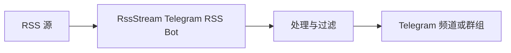

# Telegram RSS Bot - RssStream（RSS 到 Telegram 自动化）

[](./README.md)
[](./README.zh-CN.md)

RssStream 是一个 Telegram RSS 机器人，可将 RSS 订阅更新自动推送到你的 Telegram 频道和群组。

如果你在寻找稳定可靠的 RSS to Telegram 方案，RssStream 可以帮助你追踪订阅源、实时推送新内容，并通过简单命令管理订阅。

打开机器人：[在 Telegram 中启动 RssStream](https://t.me/rssStreamBot)

---

## 目录

- [什么是 RssStream](#什么是-rssstream)
- [核心功能](#核心功能)
- [工作流程](#工作流程)
- [快速开始](#快速开始)
- [命令说明](#命令说明)
- [使用场景示例](#使用场景示例)
- [订阅恢复](#订阅恢复)
- [定价](#定价)
- [常见问题](#常见问题)
- [路线图](#路线图)
- [截图](#截图)
- [贡献](#贡献)
- [反馈](#反馈)

---

## 什么是 RssStream

RssStream 是一个面向自动化的 Telegram RSS 机器人，用于将 RSS 订阅与 Telegram 消息投递连接起来。

它面向创作者、开发者和社区运营者，帮助你无需手动搬运内容，即可在 Telegram 中接收 RSS 更新。

典型使用场景：

- 新闻聚合频道
- Telegram 社区自动化
- GitHub Release 跟踪
- 博客与内容分发
- 监控多个 RSS 源更新

---

## 核心功能

- 订阅 RSS（按套餐限制）
- 自动将新 RSS 条目推送到 Telegram 频道与群组
- 支持多频道、多群组投递
- 通过简洁命令管理订阅（`/add`、`/bind`、`/list`）
- 支持账号丢失或迁移时的订阅恢复
- 低延迟更新推送
- 极简自动化工作流

---

## 工作流程



1. 添加 RSS 源并绑定到目标 Telegram。
2. RssStream 持续监控 RSS 更新。
3. 新内容将自动投递到 Telegram。

---

## 快速开始

### 1. 启动机器人

在 Telegram 中打开：[https://t.me/rssStreamBot](https://t.me/rssStreamBot)

### 2. 添加或绑定 RSS

```bash
/add https://example.com/rss
/bind <feed_id>
```

### 3. 接收更新

RssStream 会将 RSS 新内容自动推送到你的 Telegram 频道或群组。

---

## 命令说明

| 命令 | 说明 |
| --- | --- |
| `/add <rss_url>` | 向账号添加一个 RSS 订阅源。 |
| `/remove <rss_id>` | 从订阅中移除一个 RSS。 |
| `/bind <rss_id_or>` | 将订阅绑定到 Telegram 频道或群组。 |
| `/list` | 查看所有 RSS 订阅和绑定关系。 |
| `/lang` | 切换机器人语言。 |
| `/help` | 查看命令帮助与示例。 |

---

## 使用场景示例

### 科技资讯频道

- Hacker News RSS
- TechCrunch RSS
- Product Hunt RSS

### 加密货币更新

- CoinMarketCap RSS
- 交易所公告订阅源
- 代币项目新闻源

### DevOps 与工程团队

- GitHub Releases RSS
- 开源项目更新
- 工程技术博客文章

---

## 订阅恢复

如果你的 Telegram 账号丢失、更换或受限，可以使用恢复 ID 找回 RSS 订阅配置。

这可以让你的 Telegram RSS 自动化在账号变更时保持稳定。

---

## 定价

| 套餐 | 功能 |
| --- | --- |
| Free | 基础 RSS 订阅，最多 100 个源 |
| Pro（$5/月） | 更高额度与高级功能 |

Pro 可能包含：

- 每账号更多订阅数
- 更快的推送优先级
- 高级过滤规则
- 优先支持

---

## 常见问题

### 在 Telegram 获取 RSS 更新的最佳方式是什么？

使用 Telegram RSS 机器人（如 RssStream），添加并绑定 RSS 后即可自动接收新内容。

### 如何把 RSS 添加到 Telegram 群组？

启动 RssStream，执行 `/add <rss_url>`，再执行 `/bind <rss_id>` 绑定到目标群组。

### 可以在一个 Telegram 频道中追踪多个 RSS 吗？

可以。你可以订阅多个 RSS，并将它们绑定到同一个频道或群组。

### 这个 RSS 机器人支持频道和群组吗？

支持。RssStream 同时面向 Telegram 频道与群组设计。

### 如果我丢失 Telegram 账号会怎样？

你可以使用恢复 ID 进行订阅恢复，重建 RSS 配置。

---

## 路线图

- [ ] RSS 关键词过滤
- [ ] AI 文章摘要
- [ ] Web 控制台
- [ ] Webhook 集成
- [ ] 多平台支持（Discord、Slack）

---

## 截图


---

## 为什么做这个项目

RssStream 的目标是提供稳定、可靠的 RSS to Telegram 自动化分发流程，服务重视分发效率的团队与创作者，而不是做一个复杂的 RSS 阅读器。

---

## 贡献

欢迎提交 Pull Request 与功能建议。

---

## 反馈

如果你有想法或遇到问题，欢迎提 Issue，或通过 Telegram 联系。

---

## 支持

如果这个 Telegram RSS 机器人对你有帮助，欢迎给项目点一个 Star。

---
